# Student-Course Management System

A SQL-based database project for managing students, courses, instructors, departments, and enrollments in an academic setting.

---

## Project Overview

This project demonstrates a well-structured relational database system using **PostgreSQL**, normalized to **3NF**, and includes:
- Student and course registration system
- Instructor and department linking
- Enrollments tracking
- Aggregate and analytical queries
- SQL views, indexes, and a stored procedure

---

## 📷 Database Structure & Sample Data Screenshots

---

### 🖼️ 1. Checking if all tables exist
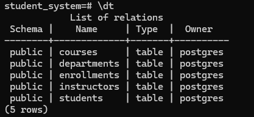

---

### 🖼️ 2. Courses Table Structure
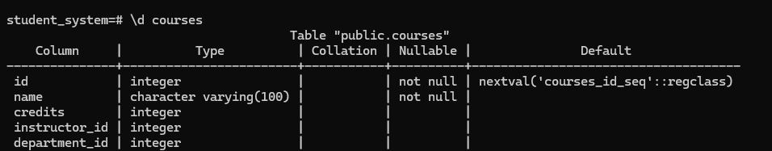

---

### 🖼️ 3. Students Table Structure
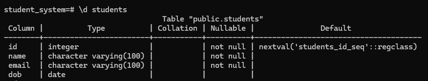

---

### 🖼️ 4. Enrollments Table Structure
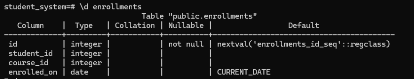

---

### 🖼️ 5. Departments Table Structure
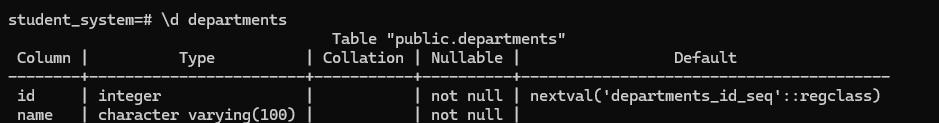

---

### 🖼️ 6. Instructors Table Structure
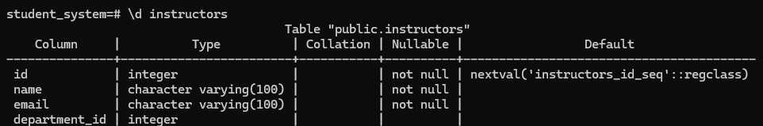

---

### 🖼️ 7. Sample Data: Students Table
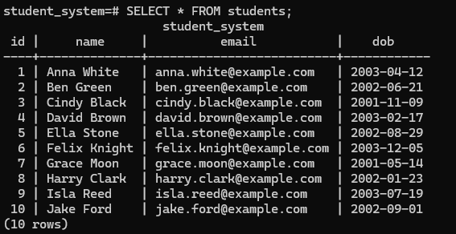

---

### 🖼️ 8. Sample Data: Courses Table
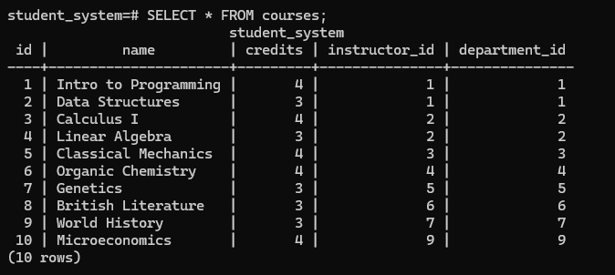

---

### 🖼️ 9. Sample Data: Departments Table
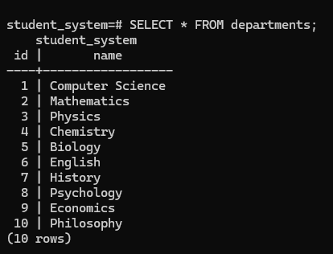

---

### 🖼️ 10. Sample Data: Instructors Table
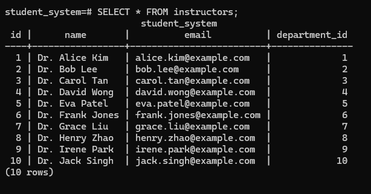

---

### 🖼️ 11. Sample Data: Enrollments Table
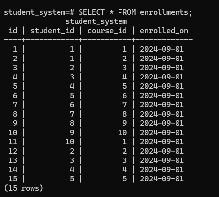

---

### 🖼️ 12. Testing a JOIN Query (Students with Enrolled Courses)
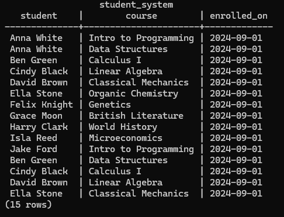

---

### 🖼️ 13. Checking Relationships (Students - Courses - Instructors)
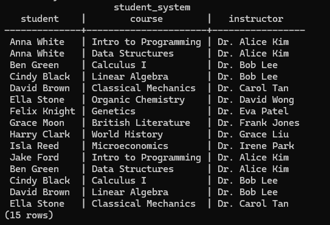

---

### 🖼️ 14. Count Check: Students Table
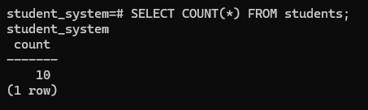

---

### 🖼️ 15. Count Check: Courses Table
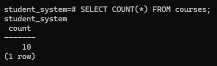

---

### 🖼️ 16. Count Check: Departments Table
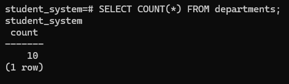

---

### 🖼️ 17. Count Check: Instructors Table
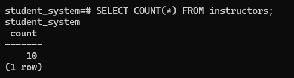

---

### 🖼️ 18. Count Check: Enrollments Table
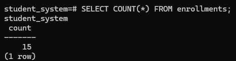

---

## Schema Design

| Table         | Description                                |
|---------------|--------------------------------------------|
| `students`    | Stores student personal information        |
| `courses`     | Stores course info and links to instructors and departments |
| `enrollments` | Many-to-many relationship between students and courses |
| `instructors` | Instructor info linked to departments      |
| `departments` | Academic departments offering courses      |

All relationships follow foreign key constraints and cascading rules for data integrity.

---

## Sample Data

Each table has at least **10 mock records**, inserted using bulk `INSERT` statements.

Use `SELECT * FROM table_name;` to verify.

